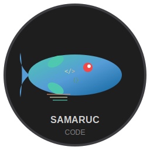

# 🐟 Samaruc Code

<div align="center">
  
  <h3>IDE moderno para desarrollo de juegos retro en C</h3>
  <p><em>Inspirado en el samaruc (Valencia hispanica), pez endémico de la Albufera de Valencia</em></p>
</div>

---

## 📋 Descripción

**Samaruc Code** es un IDE especializado construido con Electron y Monaco Editor, diseñado específicamente para el desarrollo de juegos retro en lenguaje C. Como el samaruc, este pequeño pez único de Valencia, nuestro IDE combina elegancia, eficiencia y funcionalidad en un entorno de desarrollo moderno.

## ✨ Características Principales

### 🎨 **Editor Avanzado**
- **Monaco Editor**: El mismo potente editor de VS Code
- **Resaltado de sintaxis** para C, C++, JavaScript, HTML, CSS, Python
- **Autocompletado** y sugerencias inteligentes
- **Tema Samaruc**: Paleta de colores inspirada en el mediterráneo

### 📁 **Gestión de Archivos Completa**
- **Múltiples formas de abrir**: Drag & drop, diálogo nativo, atajos de teclado
- **Archivos recientes**: Acceso rápido con `Ctrl+Shift+O`
- **Validación inteligente**: Detección automática de archivos binarios y grandes
- **Soporte UTF-8**: Codificación automática y manejo de errores

### 🎮 **Plantillas de Juegos Retro**
- **Tetris Clásico**: Implementación completa con rotación y líneas
- **Snake Game**: Juego de la serpiente con crecimiento y colisiones
- **Pong**: Clásico ping-pong con física realista
- **Plantilla Base**: Estructura fundamental para cualquier juego

### 🔧 **Herramientas Integradas**
- **Terminal integrada**: Acceso directo a compiladores
- **Explorador de archivos**: Navegación fácil por proyectos
- **Sistema de pestañas**: Múltiples archivos abiertos
- **Atajos de teclado**: Flujo de trabajo optimizado

## 🚀 Inicio Rápido

### Prerrequisitos
- **Node.js 16+**
- **Git** (opcional)
- **GCC** (para compilar juegos)

### Instalación

```bash
# Clonar el repositorio
git clone https://github.com/ginjol83/samaruc-code.git
cd samaruc-code

# Instalar dependencias
npm install

# Iniciar Samaruc Code
npm start

# O usar script personalizado (Windows)
./start-samaruc.bat
```

### Primeros Pasos

1. **Abrir archivo**: `Ctrl+O` o arrastra archivos al editor
2. **Nuevo proyecto**: `Ctrl+N` para archivo vacío
3. **Explorar plantillas**: Revisa la carpeta `templates/`
4. **Compilar código**: Usa el terminal integrado con `gcc`

## ⌨️ Atajos de Teclado

| Atajo | Acción |
|-------|---------|
| `Ctrl+O` | Abrir archivo |
| `Ctrl+N` | Nuevo archivo |
| `Ctrl+S` | Guardar archivo |
| `Ctrl+Shift+O` | Archivos recientes |
| `F12` | Herramientas de desarrollo |
| `Ctrl+W` | Cerrar pestaña |
| `Ctrl+Tab` | Cambiar entre pestañas |

## 🎯 Ejemplos de Uso

### Crear un juego básico
```c
#include <stdio.h>
#include <stdlib.h>
#include <time.h>

int main() {
    printf("¡Bienvenido a tu juego retro!\n");
    
    // Inicializar random
    srand(time(NULL));
    
    // Tu código aquí...
    
    return 0;
}
```

### Compilar desde terminal integrada
```bash
gcc -o mi_juego mi_juego.c
./mi_juego
```

## 🐠 Filosofía del Samaruc

El samaruc (*Valencia hispanica*) representa:
- **🏊‍♂️ Adaptabilidad**: Sobrevive en diversos entornos
- **⚡ Eficiencia**: Pequeño pero resistente  
- **🎨 Elegancia**: Movimientos fluidos y precisos
- **🌟 Singularidad**: Único en el mundo

Samaruc Code adopta estos valores para ofrecer:
- **Versatilidad** en tipos de proyectos
- **Rendimiento** ligero pero potente
- **Usabilidad** intuitiva y fluida
- **Innovación** en desarrollo retro

## 🧪 Modo de Prueba

Incluye herramientas de testing integradas:

```bash
# Probar funcionalidad completa
./test-complete.bat

# Probar solo apertura de archivos
./test-open.bat

# Probar en navegador
# Abrir test-browser.html en tu navegador
```

## 🔧 Desarrollo

### Estructura del Proyecto
```
samaruc-code/
├── src/                    # Código fuente principal
│   ├── main.js            # Proceso principal Electron
│   ├── renderer.js        # Lógica del renderizado
│   ├── index.html         # Interfaz principal
│   ├── styles.css         # Estilos CSS
│   └── assets/            # Iconos y recursos
├── templates/             # Plantillas de juegos
├── examples/              # Ejemplos de código
├── docs/                  # Documentación
└── tests/                 # Archivos de prueba
```

### Scripts Disponibles
```bash
npm start              # Iniciar aplicación
npm run dev            # Modo desarrollo
npm run build          # Compilar para distribución
npm test               # Ejecutar tests
```

## 🤝 Contribuir

¡Las contribuciones son bienvenidas! Como el samaruc nada mejor en cardumen, tu ayuda es valiosa.

### ¿Cómo contribuir?
1. **Fork** el repositorio
2. **Crea** una rama para tu feature (`git checkout -b feature/nueva-caracteristica`)
3. **Commit** tus cambios (`git commit -m 'Añadir nueva característica'`)
4. **Push** a tu rama (`git push origin feature/nueva-caracteristica`)
5. **Abre** un Pull Request

### Tipos de contribuciones
- 🐛 **Reportar bugs**
- ✨ **Nuevas características**
- 📚 **Mejorar documentación**
- 🎮 **Añadir plantillas de juegos**
- 🌍 **Traducciones**

## 📄 Licencia

Este proyecto está bajo la Licencia MIT. Ver el archivo [LICENSE](LICENSE) para más detalles.

## 🙏 Reconocimientos

- **Monaco Editor**: Por el excelente editor de código
- **Electron**: Por hacer posible las aplicaciones desktop con web tech
- **Comunidad de Valencia**: Por la inspiración del samaruc
- **Desarrolladores retro**: Por mantener viva la pasión por los juegos clásicos

---

<div align="center">
  <p><strong>🐟 Samaruc Code - Donde el código fluye como peces en el agua 🌊</strong></p>
  <p><em>"Como el samaruc en las aguas de la Albufera, que cada línea de código fluya con gracia y propósito."</em></p>
  
  [](https://github.com/ginjol83/samaruc-code)
  [](https://electronjs.org/)
  [](https://microsoft.github.io/monaco-editor/)
  [](https://opensource.org/licenses/MIT)
</div>
